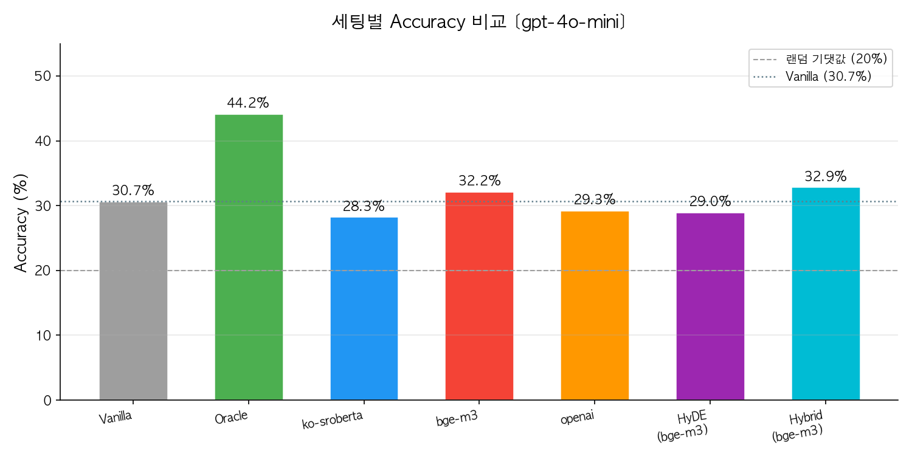
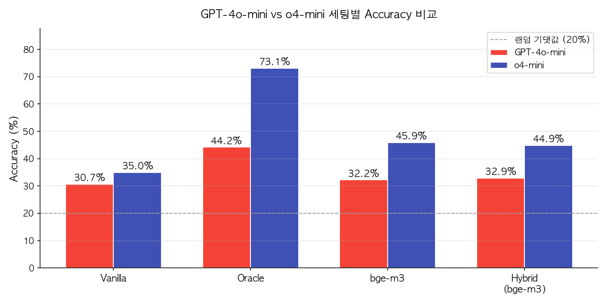
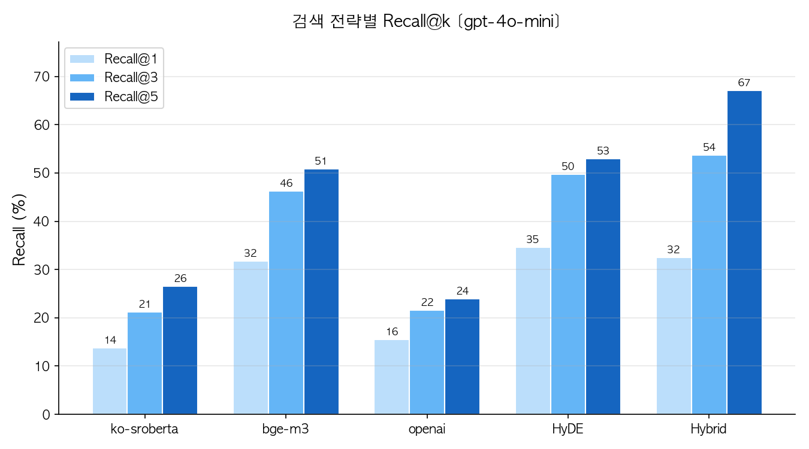
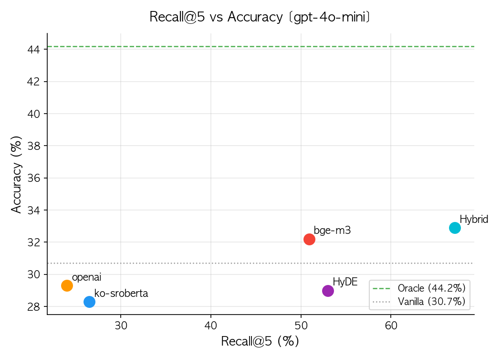
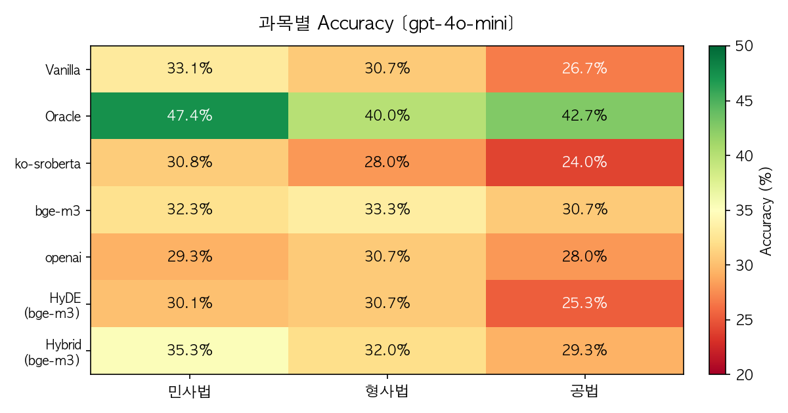
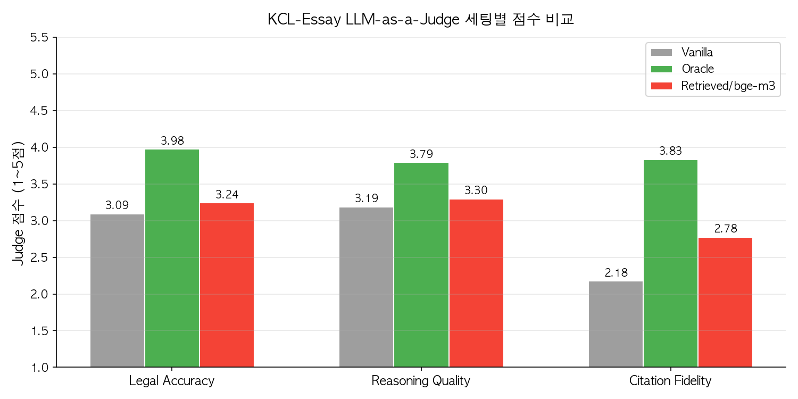
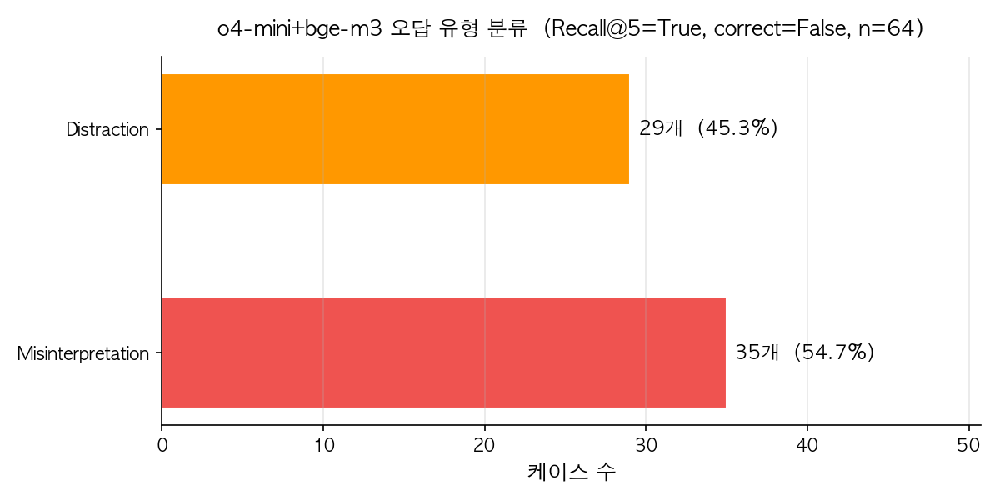

# Korean Legal RAG — Oracle vs Retrieved 성능 갭 측정

한국 변호사시험(KCL-MCQA, 283문제)을 기반으로, **법률 RAG 시스템에서 "검색 품질"이 최종 정답률에 얼마나 영향을 미치는지** 정량적으로 측정한 실험 프로젝트.

> 기반 논문: *Korean Canonical Legal Benchmark* (EACL 2026) — [arXiv](https://arxiv.org/abs/2512.24572) · [HuggingFace Dataset](https://huggingface.co/datasets/lbox/kcl)
> 논문은 "정답 판례를 직접 주입(Oracle)"했을 때만 측정. 이 프로젝트는 **실제 서비스 환경인 Retrieved RAG를 추가**해 두 세팅의 갭을 수치로 확인함.

---

## 실험 구조

```
Vanilla             Oracle              Retrieved RAG
────────────        ────────────        ────────────────────
판례 없이            정답 판례을          벡터 검색으로
LLM만으로 풀기        직접 주입            판례를 찾아서 주입

(성능 하한)          (논문이 측정)         (이 프로젝트가 추가)
                    (성능 상한)          (실제 서비스 상황)
```

**핵심 질문**: 검색 품질(Recall@k)이 최종 Accuracy를 얼마나 제한하는가?
**측정 지표**: Accuracy (정답률) · Recall@1/3/5 (검색 품질)

---

## 주요 결과

### 1. 전체 Accuracy — GPT-4o-mini



| Setting | Embedding | Accuracy | Recall@5 |
|---------|-----------|:--------:|:--------:|
| Vanilla | — | 30.7% | — |
| Oracle | — | **44.2%** | — |
| Retrieved | ko-sroberta | 28.3% | 26.5% |
| Retrieved | **bge-m3** | **32.2%** | 50.9% |
| Retrieved | openai | 29.3% | 24.0% |
| HyDE | bge-m3 | 29.0% | 53.0% |
| Hybrid (BM25+벡터) | bge-m3 | **32.9%** | **67.1%** |

- **bge-m3만 Vanilla를 초과** — 검색 품질이 낮으면(ko-sroberta, openai) 아무것도 안 넣는 것보다 낮아짐
- **Oracle 갭 11.3%p** — 검색이 병목. 아무리 좋은 LLM도 검색이 뒷받침되지 않으면 Oracle에 못 미침

---

### 2. GPT-4o-mini vs o4-mini — Reasoning 모델의 역설



| Setting | GPT-4o-mini | o4-mini | 차이 |
|---------|:-----------:|:-------:|:----:|
| Vanilla | 30.7% | 35.0% | +4.3%p |
| Oracle | 44.2% | **73.1%** | **+28.9%p** |
| Retrieved/bge-m3 | 32.2% | **45.9%** | +13.7%p |
| Hybrid | 32.9% | 44.9% | +12.0%p |

- **Vanilla에선 두 모델이 거의 비슷**하지만, Oracle에선 폭발적으로 벌어짐
- Reasoning 모델의 강점은 "판례를 보고 법적 논리를 따라가는 것" — 판례가 없으면 차이가 없음
- **o4-mini Retrieved(45.9%) > GPT-4o-mini Oracle(44.2%)** — 불완전한 검색으로도 일반 모델의 이상적 조건을 초과

> **역설**: Hybrid(Recall@5=67.1%)에서 o4-mini는 오히려 -1.0%p 하락. Reasoning 모델은 BM25가 끌어온 노이즈 판례를 더 깊이 처리해 역효과가 증폭됨.

---

### 3. 검색 전략별 Recall@k



- **Hybrid(BM25+벡터+RRF)가 Recall@5=67.1%로 최고** — BM25가 벡터 검색이 놓친 판례를 키워드로 보완
- **HyDE는 Recall@5=53.0%로 향상됐지만 Accuracy는 -3.2%p 하락** — 가상 판례의 잘못된 법적 논리가 LLM 추론을 오염

---

### 4. Recall@5 vs Accuracy 상관관계



검색 품질(x축)과 최종 정답률(y축)의 관계. Oracle은 그래프 밖(Recall=100%, Acc=44.2%)의 기준선.

- Recall@5가 높을수록 Accuracy도 높지만, **HyDE는 예외** — Recall↑인데 Accuracy↓
- Hybrid는 Recall@5=67%로 가장 높지만, Oracle(44.2%)과의 갭이 여전히 11%p 이상 남음
- 이 갭을 좁히려면 **상위 k개 중 정답 판례를 1번으로 올리는 리랭킹**이 필요

---

### 5. 과목별 Accuracy — GPT-4o-mini



- **공법에서 검색 효과가 가장 약함** — 헌법·행정법 판례는 추상적 법원칙이 많아 임베딩 유사도 매칭이 어려운 것으로 추정
- **bge-m3는 형사법에서 33.3%로 가장 균형적** — 사실관계 중심 판례에서 의미 검색이 더 효과적

---

### 6. 에세이 평가 — KCL-Essay LLM-as-a-Judge (169문제)



5지선다(MCQA)와 다르게 정답이 없는 서술형 에세이에서도 동일한 세팅을 비교.
gpt-4o-mini Judge가 3가지 기준(1~5점)으로 채점.

| Setting | Legal Accuracy | Reasoning Quality | Citation Fidelity | **Avg** |
|---------|:--------------:|:-----------------:|:-----------------:|:-------:|
| Vanilla | 3.09 | 3.19 | 2.18 | **2.82** |
| Oracle | 3.98 | 3.79 | 3.83 | **3.87** |
| Retrieved/bge-m3 | 3.24 | 3.30 | 2.78 | **3.11** |

- **Citation Fidelity 격차가 가장 큼** (Vanilla 2.18 → Oracle 3.83, +1.65점)
  판례가 없으면 LLM이 판례를 지어내거나(환각) 인용 자체를 피함
- Legal Accuracy·Reasoning Quality는 세팅 간 차이가 상대적으로 작음 — 법적 논리 구성 자체는 판례 유무와 무관하게 어느 정도 유지됨
- **MCQA 패턴과 동일**: Oracle이 압도적으로 좋고, Retrieved는 중간

---

### 7. 오답 유형 분석 — LLM-as-a-Judge



o4-mini + bge-m3에서 **판례는 찾았는데 틀린 64개 케이스**를 gpt-4o-mini Judge가 분류.

| 유형 | 건수 | 설명 |
|------|:----:|------|
| Misinterpretation | 35 (54.7%) | 정답 판례를 읽었지만 법적 해석을 잘못함 |
| Distraction | 29 (45.3%) | 유사 선택지 트랩에 빠져 판례를 잘못 적용 |
| Noise Dominance | 0 | — |
| Irrelevant | 0 | — |

**Noise Dominance = 0%의 의미**: 실패 원인이 "판례 순위 문제"가 아님.
Cross-Encoder 리랭킹으로 정답 판례를 top-1으로 올려도 Misinterpretation(54.7%)은 해결되지 않음.
→ 검색 파이프라인 개선의 한계를 데이터로 확인. 법률 도메인 특화 파인튜닝이 필요한 영역.

---

## 기술 스택

| 역할 | 기술 |
|------|------|
| 벡터 DB | PostgreSQL 16 + pgvector (IVFFlat, cosine) |
| 컨테이너 | Docker (pgvector/pgvector:pg16) |
| 임베딩 | ko-sroberta-multitask (768d) · BAAI/bge-m3 (1024d) · text-embedding-3-small (1536d) |
| 키워드 검색 | BM25 (rank-bm25, 공백 토크나이저) |
| 검색 결합 | RRF (Reciprocal Rank Fusion, k=60) |
| LLM | gpt-4o-mini · o4-mini-2025-04-16 (`reasoning_effort="low"`) |
| 데이터 | HuggingFace `lbox/kcl` (kcl_mcqa · kcl_essay) |
| 언어 | Python 3.14 |

---

## 구현 중 마주친 문제들

| 문제 | 원인 | 해결 |
|------|------|------|
| bge-m3 OOM (`Invalid buffer size: 256GiB`) | `max_seq_length=8192`, 어텐션 행렬이 시퀀스 길이²에 비례 | `max_seq_length=512`, `batch_size=4`로 제한 |
| OpenAI API 토큰 초과 | 문자 수 기반 토큰 추정 부정확 (한국어 0.62→실제 0.93 토큰/자) | `tiktoken`으로 실제 토큰 수 측정 후 8,000 이하로 절단 |
| GPT-4o-mini Rate Limit | Oracle 세팅에서 긴 판례 컨텍스트로 TPM 초과 | 지수 백오프 재시도 (`wait *= 2`) |
| o4-mini 응답 빈 문자열 | `max_completion_tokens=500`으로 reasoning 토큰이 출력 공간 소진 | `max_completion_tokens=5000` + `reasoning_effort="low"` |
| Oracle 에세이 컨텍스트 길이 초과 | 판례 전문 평균 18K 토큰, 최대 130K 토큰 | `MAX_PRECEDENT_CHARS=120,000`으로 절단 |

---

## 실행 방법

```bash
# 1. 환경 설정
pip install -r requirements.txt
cp .env.example .env  # OPENAI_API_KEY 설정

# 2. DB 초기화 (Docker + PostgreSQL + pgvector)
docker-compose up -d
bash scripts/01_setup_db.sh

# 3. 판례 인덱싱
python scripts/02_index.py --model bge-m3
python scripts/02_index.py --create-index

# 4. MCQA 실험 실행 (중간에 끊겨도 재실행 안전)
python scripts/03_run_experiments.py --setting vanilla
python scripts/03_run_experiments.py --setting oracle
python scripts/03_run_experiments.py --setting retrieved --model bge-m3
python scripts/03_run_experiments.py --setting retrieved --model bge-m3 --llm o4-mini-2025-04-16

# 5. Hybrid 실험
python scripts/05_run_search_experiments.py --setting hybrid --model bge-m3

# 6. 에세이 Judge 실험
python scripts/07_run_essay_experiments.py

# 7. 오답 분류
python scripts/06_judge_error_analysis.py

# 8. 시각화 (results/ 에 fig1~fig7 생성)
python scripts/04_analyze.py
```

---

## 폴더 구조

```
kcl-rag/
├── src/
│   ├── data/loader.py              # HuggingFace KCL 데이터셋 파싱
│   ├── db/
│   │   ├── schema.sql              # 테이블 DDL
│   │   └── client.py               # psycopg2 연결
│   ├── embeddings/encoder.py       # 3종 임베딩 모델 통합 인터페이스
│   ├── indexing/indexer.py         # 판례 벡터 인덱싱
│   ├── retrieval/
│   │   ├── retriever.py            # 벡터 검색 + Recall@k
│   │   ├── hyde_retriever.py       # HyDE 가상 판례 생성 + 검색
│   │   └── hybrid_retriever.py     # BM25 + 벡터 + RRF
│   └── evaluation/
│       ├── _common.py              # LLM 호출, 파싱, DB 저장 공통 유틸
│       ├── vanilla.py / oracle.py / retrieved.py
│       ├── hyde.py / hybrid.py
│       ├── judge_error_analysis.py # 오답 유형 분류 (LLM-as-a-Judge)
│       └── essay_judge.py          # 에세이 생성 + Judge 채점
├── scripts/
│   ├── 02_index.py                 # 인덱싱
│   ├── 03_run_experiments.py       # MCQA 실험
│   ├── 04_analyze.py               # 결과 분석 + 시각화 (fig1~fig7)
│   ├── 05_run_search_experiments.py
│   ├── 06_judge_error_analysis.py
│   └── 07_run_essay_experiments.py
├── results/                        # 생성된 그래프 (fig1~fig7)
└── docs/
    └── ERROR_ANALYSIS.md           # 상세 오답 분석 리포트
```

---

## 데이터셋

- **출처**: [lbox/kcl](https://huggingface.co/datasets/lbox/kcl) (HuggingFace)
- **MCQA**: 283문제 + 판례 1,103개 (민사법 133 / 형사법 75 / 공법 75)
- **Essay**: 169문제 + 2,739개 루브릭
- **판례 형태**: 판결문 전체가 아닌 문제별 핵심 부분만 추출된 텍스트 → 청킹 불필요
